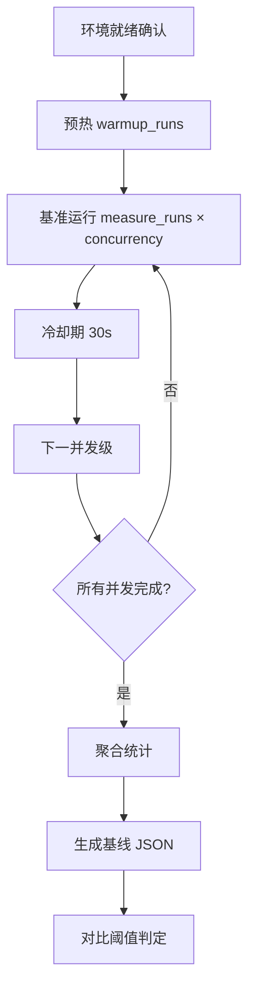

# 性能基准测试方法论

> **目的**：定义性能基准测试的标准流程、工具选型、环境要求与结果解读规范，确保基线可复现、可对比。

---

## 1. 测试工具选型

| 工具 | 适用场景 | 优势 | 劣势 | 推荐指数 |
|------|----------|------|------|----------|
| **hey** | HTTP/JSON API、简单负载 | 单二进制、零依赖、输出结构化、Go 编译快 | 无脚本逻辑、不支持 WebSocket | ⭐⭐⭐⭐⭐ 首选 |
| **k6** | 复杂场景、脚本化、CI 集成 | JS 脚本、检查点/阈值原生、结果可视化好 | 需安装、学习曲线稍陡 | ⭐⭐⭐⭐ 复杂场景首选 |
| **locust** | 分布式压测、用户行为建模 | Python 生态、主从分布式、Web UI | 资源占用大、启动慢 | ⭐⭐⭐ 大规模/长运行 |
| **wrk** | 极高并发、原始吞吐基线 | Lua 脚本、极轻量、延迟分布精确 | 仅 Linux/macOS、无原生 JSON | ⭐⭐ 基线极值探测 |

**默认策略**：`hey` 作为 CI 门禁基准工具；`k6` 用于复杂业务流；`locust` 用于预发布大规模演练。

---

## 2. 测试环境标准化

### 2.1 硬件规格锁定
- **CPU**：固定 vCPU 数（如 4 vCPU），禁用超线程或锁定频率
- **内存**：固定容量（如 8 GB），禁用 swap
- **网络**：同可用区、同 VPC、带宽不限速
- **存储**：本地 NVMe SSD，避免网络存储抖动

### 2.2 软件环境
- **被测服务**：同一镜像、同一配置、同一副本数
- **依赖服务**：数据库/缓存/队列必须为独立实例、预热完成
- **监控采集**：Prometheus + node_exporter + cadvisor，1s 采样间隔

### 2.3 环境隔离
- **专用命名空间/资源组**，无其他工作负载干扰
- **流量隔离**：仅测试流量进入，生产流量完全切走

---

## 3. 测试流程规范



### 3.1 预热阶段
- **目的**：JIT 编译、连接池填充、缓存预热、GC 稳态
- **最小轮数**：10 次请求或 30 秒，取较大者
- **丢弃数据**：预热结果**不计入**统计

### 3.2 正式测量
- **并发梯度**：`[1, 10, 50, 100]`（可按服务能力调整）
- **每并发持续**：最小 100 次请求或 60 秒，取较大者
- **采样指标**：吞吐、P50/P90/P99 延迟、错误率、CPU、内存、网络 I/O

### 3.3 统计聚合规则
| 指标 | 聚合方式 | 备注 |
|------|----------|------|
| 吞吐 | 算术平均 | 单位：RPS |
| 延迟分位 | 合并所有样本后计算 | **不**对各轮分位取平均 |
| 错误率 | 总错误数 / 总请求数 | 包含超时、非 2xx、连接失败 |
| 资源指标 | 时间加权平均 | 对齐请求时间窗口 |

---

## 4. 基线建立判据

| 判定 | 条件 | 动作 |
|------|------|------|
| **PASS** | 所有核心指标 ≤ 目标值 | 写入基线库，标记 `baseline-latest` |
| **WARN** | 非核心指标超阈值 ≤ 15% | 允许写入，标记需关注，人工复核 |
| **FAIL** | 任一核心指标 > 目标值 或 非核心 > 15% | **阻断**，输出差异报告，禁止入库 |

**核心指标默认集**：P99 延迟、错误率、吞吐下限

---

## 5. 结果存储与版本管理

```
.hermes/perf/
├── benchmarks.yaml          # 指标定义（Git 版本控制）
├── baseline-latest.json     # 当前生效基线（软链接）
├── baseline-20260926T143000Z.json  # 历史快照（时间戳命名）
└── reports/
    ├── gate-20260926T143000Z.json  # CI 门禁报告
    └── monitor-20260926T060000Z.json  # 监控快照
```

- **baseline-latest.json** 必为软链接，指向最新通过判定的基线
- **历史基线** 永不删除，支持回滚与趋势分析
- **benchmarks.yaml** 变更即视为基线失效，需重新建立

---

## 6. 常见陷阱与规避

| 陷阱 | 症状 | 规避措施 |
|------|------|----------|
| 冷启动污染 | 首轮 P99 异常高 | 强制预热、丢弃前 10% 样本 |
| GC 抖动 | 延迟周期性尖峰 | 固定堆大小、记录 GC 日志关联分析 |
| 连接复用不足 | 建连开销主导延迟 | 强制 HTTP Keep-Alive、连接池预热 |
| 后端自动扩缩容 | 吞吐不稳定 | 测试期间锁定副本数 HPA min=max |
| 共享依赖争用 | 数据库/Redis 成为瓶颈 | 专用实例、预热数据集、隔离租户 |
| 时钟漂移 | 分布式追踪时间错乱 | 所有节点 NTP 同步、用单调时钟 |

---

## 7. 交付物清单

每次基线建立必须产出：
1. `baseline-<timestamp>.json` — 机器可读，含所有原始聚合指标
2. `baseline-report-<timestamp>.md` — 人类可读，含判定表、趋势对比、环境快照
3. `benchmarks.yaml` 快照副本 — 对应版本的指标定义

---

*版本：1.0.0 | 维护：perf-baseline skill | 更新：2026-09-27*