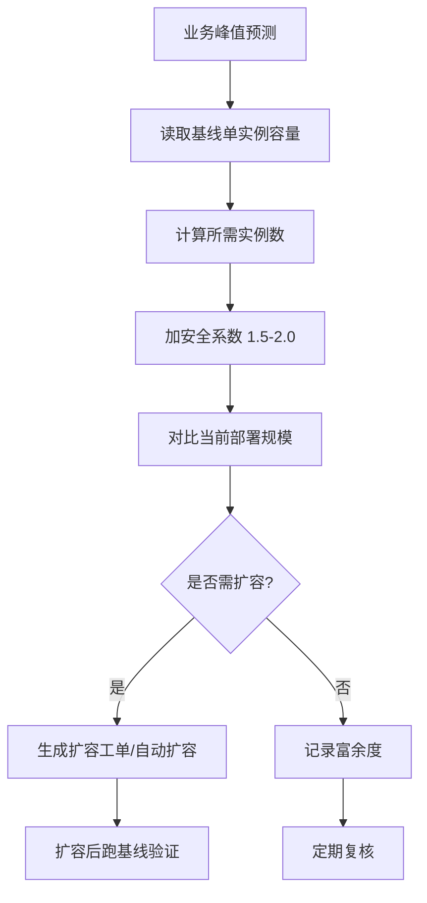

# 容量规划指南

> **目的**：基于性能基线数据，指导容量预估、扩容决策、成本优化，支撑 S6 运维巡检与 S5 发布前容量校验。

---

## 1. 容量模型基础

### 1.1 核心公式

```
所需实例数 = ceil(目标峰值 RPS / 单实例可承载 RPS × 安全系数)
```

| 参数 | 来源 | 典型值 |
|------|------|--------|
| 目标峰值 RPS | 业务预测 / 历史峰值 × 增长系数 | 如 10,000 RPS |
| 单实例可承载 RPS | `perf-baseline` 基线 `throughput_rps`（取 P99 满足 SLA 时的并发点）| 如 200 RPS |
| 安全系数 | 经验值，含突发、故障、部署窗口 | **1.5~2.0** |

### 1.2 单实例容量测定（来自基线）

从 `baseline-latest.json` 读取：
- 在 P99 ≤ SLA 目标（如 200ms）的最大并发级下的吞吐
- 对应的 CPU、内存占用
- **此即「单实例标称容量」**

---

## 2. 容量规划流程



### 2.1 触发时机
| 时机 | 动作 |
|------|------|
| **大促/活动前** | T-2 周跑全链路基线，按预测峰值 × 1.5 规划 |
| **版本发布前 (S5)** | `ci-cd` 读取基线，校验当前规模 ≥ 所需实例数 × 1.2 |
| **月度巡检 (S6)** | 对比实际峰值 vs 规划峰值，偏差 > 20% 触发重规划 |
| **架构变更后** | 重新建立基线，重新规划 |

---

## 3. 扩容决策矩阵

| 当前利用率 | 趋势 | 动作 |
|------------|------|------|
| < 40% | 稳定/下降 | 考虑缩容降本 |
| 40%~60% | 稳定 | 维持，关注增长 |
| 60%~75% | 上升 | 准备扩容，纳入下周计划 |
| 75%~85% | 上升 | **立即扩容**，并行排查代码退化 |
| > 85% | 任意 | **P0 紧急扩容**，同时限流保核心 |

---

## 4. 成本优化策略

### 4.1 规格选型
| 场景 | 推荐规格 | 理由 |
|------|----------|------|
| CPU 密集（加密、压缩、编码） | 高主频 CPU 型 | 单核性能决定吞吐上限 |
| 内存密集（缓存、大对象处理） | 高内存型 | 避免 Swap/OOM，内存带宽关键 |
| IO 密集（下载、数据库代理） | 网络增强型/存储优化型 | 网络/磁盘带宽为瓶颈 |
| 通用 Web/API | 平衡型（通用计算） | 性价比最优 |

### 4.2 混合部署与弹性
- **基础池**：预留实例（Reserved/预付费）覆盖 70% 基础负载
- **弹性池**：按量/Spot 实例应对峰值 30%
- **夜间/低峰**：缩容至基础池，定时任务跑批

---

## 5. 关键指标监控看板（Grafana 推荐）

| 面板 | 指标来源 | 告警阈值 |
|------|----------|----------|
| 实例级 CPU/内存/网络 | node_exporter + cAdvisor | CPU > 75% 5min |
| 服务级 RPS/P99/错误率 | Prometheus (应用 metrics) | P99 > SLA × 1.2 |
| 单实例吞吐趋势 | `perf-baseline` 基线 + 实时采样 | 低于基线 80% |
| 容量富余度 | (当前实例数 × 单实例容量) / 实时峰值 RPS | < 1.2 |

---

## 6. 容量规划交付物

每次规划产出 `capacity-plan-<timestamp>.md`：

```markdown
# 容量规划报告 - <日期>

## 业务假设
- 预测峰值 RPS: X
- 增长系数: 1.3 (基于历史 3 个月)
- SLA: P99 ≤ 200ms, 错误率 < 0.1%

## 基线数据 (来源: perf-baseline)
- 单实例标称容量: Y RPS (P99=180ms 时)
- 单实例资源: CPU 60%, Mem 512MB

## 规划结果
| 环境 | 当前实例数 | 所需实例数 | 富余度 | 动作 |
|------|------------|------------|--------|------|
| Production | 20 | 18 | 1.11 | 维持 |
| Staging | 3 | 2 | 1.50 | 可减 1 |

## 扩容/缩容计划
- [ ] Production: 无需变更
- [ ] Staging: 减 1 实例 (节省 $xx/月)

## 风险提示
- 单实例容量基于 v1.2.3 基线，v1.3.0 发布后需重跑基线
- 依赖 Redis 集群为共享资源，未纳入单实例模型
```

---

## 7. 与五位咬合

| 阶段 | 咬合点 | 产物 |
|------|--------|------|
| **S4** | `quality-gate` 门禁 | 基线必须 PASS，才能作为容量规划输入 |
| **S5** | `ci-cd` 发布前 | 读取基线 → 校验当前规模 ≥ 1.2× 所需 → PASS 才允许发布 |
| **S6** | `pipeline-stage-guard` 复盘 | 趋势章节包含：实际峰值 vs 规划、富余度变化、扩容记录、成本优化建议 |
| **Cross** | `context-keeper` | 同步「单实例标称容量」「当前富余度」到 `MEMORY.md` |

---

## 8. 常见误区

| 误区 | 后果 | 正确做法 |
|------|------|----------|
| 用平均 RPS 规划 | 峰值时宕机 | **必须用峰值 RPS** (P99 时间窗口内) |
| 忽略安全系数 | 单点故障导致雪崩 | **最小 1.5**，核心链路 2.0 |
| 基线过期未更新 | 规划严重偏离 | **每版本发布后/月度** 必须重跑基线 |
| 只看 CPU 不看延迟 | CPU 低但 P99 超标 | **以 SLA 满足点的吞吐为准**，非 CPU 饱和点 |
| 共享依赖未建模 | 数据库/Redis 成瓶颈 | 依赖侧单独建模、独立规划 |

---

*版本：1.0.0 | 维护：perf-baseline skill | 更新：2026-09-27*