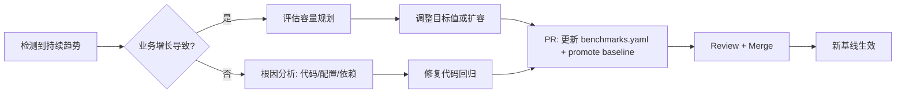

# 性能回归检测策略

> **目的**：定义 CI 门禁、定时监控、复盘分析中如何判定“性能退化”，以及分级响应机制。

---

## 1. 回归判定核心逻辑

### 1.1 指标分类与阈值矩阵

| 指标类别 | 典型指标 | 优化方向 | 核心阈值 (FAIL) | 预警阈值 (WARN) | 备注 |
|----------|----------|----------|-----------------|-----------------|------|
| **延迟类** | P50/P90/P99 | 越小越好 | **+5%** | **+3%** | 核心路径 P99 为主 |
| **吞吐类** | RPS、QPS | 越大越好 | **-5%** | **-3%** | 核心接口为主 |
| **可靠性** | 错误率、超时率 | 越小越好 | **> 1%** 或 **+50%相对** | **> 0.5%** | 绝对值优先 |
| **资源类** | CPU%、内存、网络 | 越小越好 | **+15%** | **+10%** | 非核心，仅参考 |

### 1.2 端点分级

```yaml
# benchmarks.yaml 中定义
thresholds:
  core:        {max_regression: 5, alert: 3}    # 核心业务：登录、搜索、下单、支付
  non_core:    {max_regression: 15, alert: 10}  # 非核心：管理、报表、导出
  new_endpoint: {establish_only: true}           # 新接口：仅建基线，不判定
```

**分级原则**：
- **Core**：直接影响用户核心体验、收入链路、SLA 承诺
- **Non-core**：内部工具、低频操作、可降级功能
- **New**：首版发布，无历史基线，仅建立

---

## 2. 检测场景与触发时机

| 场景 | 触发方式 | 执行动作 | 输出 |
|------|----------|----------|------|
| **CI 门禁 (S4)** | 每次 PR merge / push main | `perf-baseline --action gate --threshold-profile core` | PASS/WARN/FAIL + 报告 |
| **发布门禁 (S5)** | 发布流水线前置 | 同 CI 门禁，FAIL 则阻断发布 | 发布判定 |
| **定时监控 (S6)** | Cron / GH Actions schedule (每 5min) | `perf-baseline --action monitor --window 5m` | 告警事件 |
| **复盘分析 (S6)** | 迭代结束手动/自动 | `perf-baseline --action retro --since --until` | 趋势章节 |

---

## 3. 统计判定方法

### 3.1 变化率计算
```
change_pct = (current - baseline) / baseline × 100%
```

### 3.2 判定规则（伪代码）
```python
def judge(metric, current, baseline, thresholds):
    if metric in latency_metrics + error_metrics + resource_metrics:
        # 越小越好
        if change_pct > max_regression: return FAIL
        elif change_pct > alert: return WARN
        elif change_pct < -5: return IMPROVED
        else: return PASS
    else:  # throughput
        if change_pct < -max_regression: return FAIL
        elif change_pct < -alert: return WARN
        elif change_pct > 5: return IMPROVED
        else: return PASS
```

### 3.3 多并发级聚合判定
- **任一并发级 FAIL** → 整体 FAIL
- **无 FAIL 但有 WARN** → 整体 WARN
- **全 PASS/IMPROVED** → 整体 PASS

### 3.4 连续性规则（监控场景）
- **连续 3 个窗口 (15min) 超过 1.2× 基线** → P1 告警
- **单窗口错误率 > 1%** → P0 立即告警
- 避免抖动误报：需连续性确认

---

## 4. 响应分级与 SLA

| 级别 | 触发条件 | 响应时限 | 责任人 | 升级路径 |
|------|----------|----------|--------|----------|
| **P0** | 错误率 > 1% 或 核心接口不可用 | 15 min | On-call + Tech Lead | 1h 未解决 → VP |
| **P1** | 核心指标连续退化 > 阈值 | 1 小时 | On-call | 4h 未解决 → Tech Lead |
| **P2** | 非核心指标退化、资源趋势异常 | 1 个工作日 | 所属组 | 下迭代计划优化 |
| **P3** | 信息级：基线升级建议、新端点需求 | 下复盘会 | Performance Owner | 纳入规划 |

---

## 5. 误报/漏报控制

| 问题 | 原因 | 对策 |
|------|------|------|
| **冷启动误报** | 首轮请求慢 | 强制预热 10 次/30s，丢弃前 10% 样本 |
| **GC 抖动误报** | 定期 Full GC | 固定堆、记录 GC 日志关联、中位数而非平均数 |
| **网络抖动** | 跨 AZ/跨网段 | 同可用区测试、多次取中位数 |
| **后端扩缩容** | HPA 变副本数 | 测试期锁定 min=max |
| **数据量增长** | 业务自然增长导致延迟上升 | 区分“业务增长退化” vs “代码退化”，定期有意识升级基线 |

---

## 6. 基线升级流程（有意识漂移管理）



**关键原则**：
- **严禁**静默修改基线掩盖退化
- **必须**通过 PR，经性能 Owner Review
- **记录**升级理由：业务增长 / 架构优化 / 基础设施升级
- **保留**旧基线快照，支持回滚对比

---

## 7. 工具链集成

| 工具 | 用途 | 集成点 |
|------|------|--------|
| **hey/k6** | 负载生成 | `run_benchmarks.py` 封装 |
| **Prometheus + Alertmanager** | 监控采集/告警 | `monitor` 动作推送指标 |
| **GitHub Actions** | CI/定时任务 | `gate`/`monitor`/`retro` workflows |
| **Slack/钉钉 Webhook** | 告警通知 | `--alert-webhook` 参数 |
| **Grafana** | 趋势看板 | 读取 `baseline-*.json` + `monitor-*.json` |

---

*版本：1.0.0 | 维护：perf-baseline skill | 更新：2026-09-27*